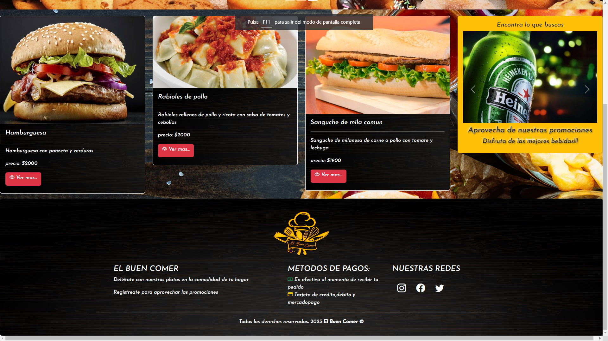
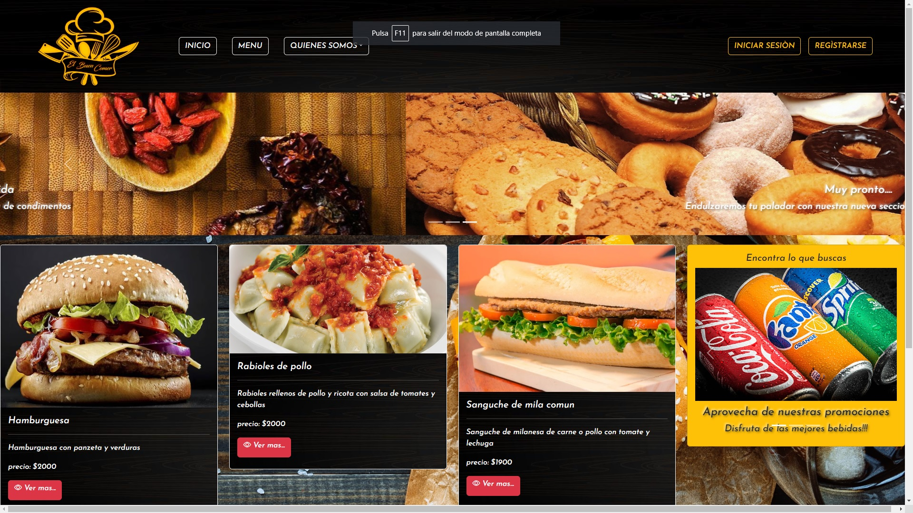
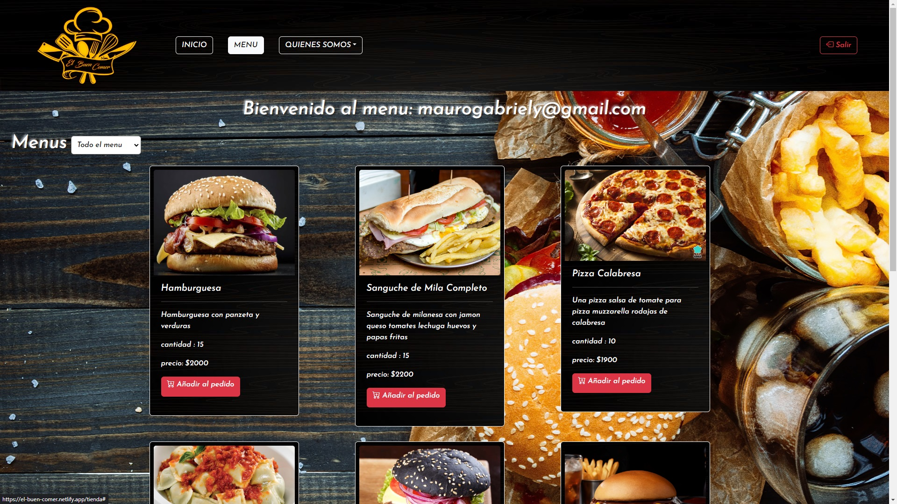
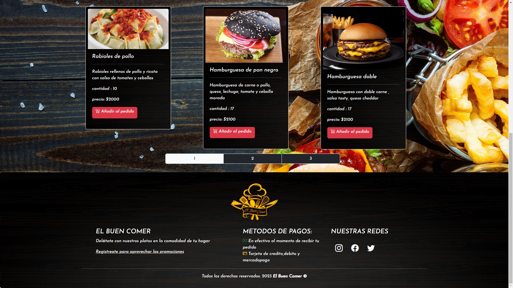
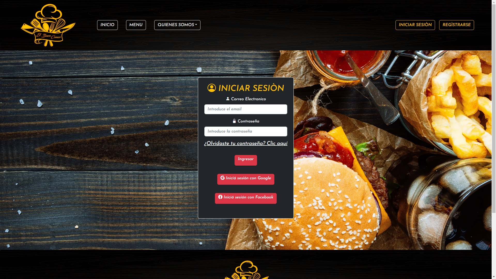
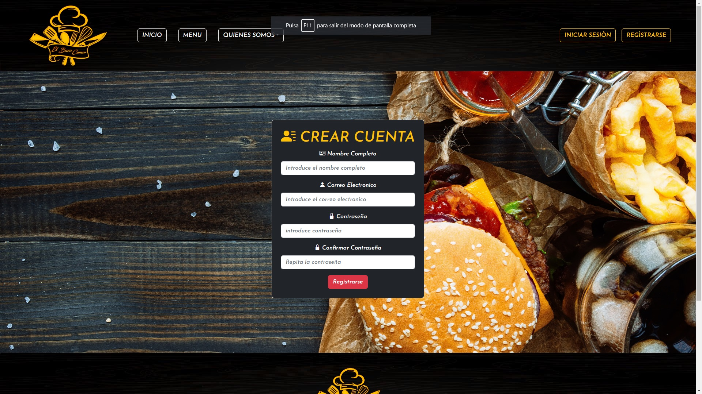
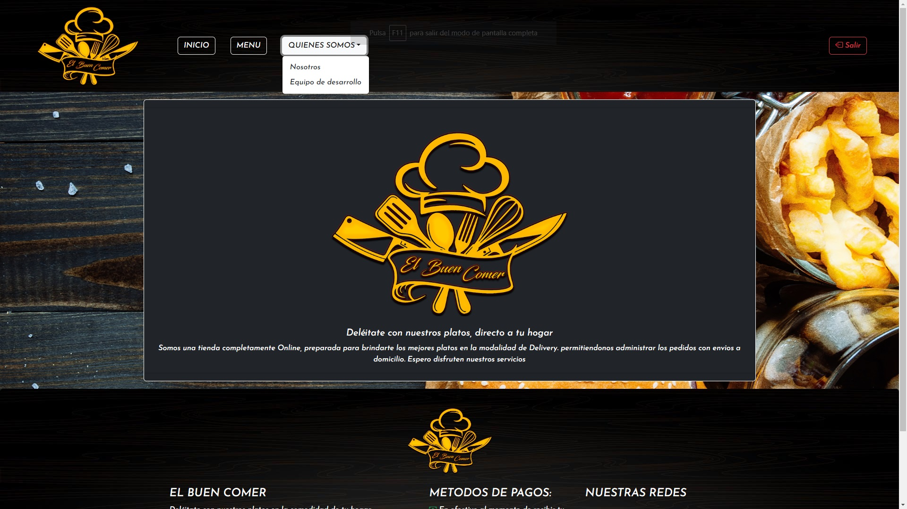

# El Buen Comer  - SPA (Deployado y Responsivo)

  

  

  

  

  

  

  

► Deploy Frontend: https://el-buen-comer.netlify.app/

Tecnologías necesarias:
* React
* Node
* Express
* MongoDB
* mongoose

IMPORTANTE: Se utilizo Bootstrap, react-bootstrap, sweetalert y sus correspondientes estilos, ademas de CSS puro.

# Descripción
Esta es una aplicación en la cual se pueden ver algunos menus junto con información de los mismos pudiendo filtrar por categorias y realizar pedidos eligiendo el metodo de pago que quieras,
para ello cuenta con la funcion de registrarse y iniciar sesion para los usuarios y funciones de cargar, crear, editar y eliminar datos entre otras, para los administradores.

* Iniciar sesion/Login donde el usuario puede autenticarse
* Registro donde el usuario nuevo puede darse de alta
* Pagina principal con información del restaurante y los menús disponibles
* Pagina de Menus para que los usuarios puedan seleccionar el que deseen
* Pedidos página que contendrá los menús seleccionados por el usuario y su costo total
* Admin página donde se muestran los listados de usuarios, menús y pedidos y además realiza diferentes operaciones operaciones

#### Frontend

Aplicación de React
__Pagina inicial__: 
Landing page con:
- [ ] Barra de Navegacion con los siguientes botones:
  * Boton Inicio/Logo dirigien al home de la aplicacion (`Ruta principal`)
  * Boton Menu para dirigirse a donde el usuario puede seleccionar los menus que decean
  * Boton Desplegable QUIENES SOMOS con las opciones de NOSOTROS y el EQUIPO DE DESARROLLO
  * Boton de Iniciar sesion para dirigirte al formulario del login
  * Boton de Registrarse para dirigirse al formulario de registro
    
- [ ] Carousel de imagenes representativas del sitio
- [ ] Area principal donde se mostraran 3 menus diferentes cada vez que se actualice el sitio (siempre y cuando esten disponibles)
- [ ] Area donde se muestran imagenes promocionales de bebidas
- [ ] Parte inferior de la página con información relevante de la misma

__Pagina Menu__:
- [ ] Filtrar menus por categoria
- [ ] Muestra los menus siempre y cuando quede cantidad y tenga el estado de "activo"
- [ ] Generacion del carrito PEDIDOS con los menus selleccionado por el usuario detallado y su precio total
- [ ] Eleccion de pago en efectivo o atravez de mercadopago FUNCIONAL
   
__Paginas Quienes somos__:
 - [ ] Pagina Nosotros con informacion y una leyenda sobre el restaurante
 - [ ] Pagina de equipo de desarollo con informaciond el desarrollador
   
__Pagina Iniciar sesion__:
 - [ ] Formulario donde se ingresan los siguientes datos:
     * Email
     * Contraseña
 - [ ] Restablecer contraseña FUNCIONAL que envia un email al correo por si se olvida la contraseña y desea restablecerla mediante el uso de emailjs
 - [ ] Botones para iniciar con google o facebook 
 
__Pagina Registro__:
- [ ] Formulario para alta de usuario con los siguientes datos:
       
     * Contraseña
     * Nombre Cmpleto
     * Email
     * Contraseña (con metodo de encriptacion)
      
      
__Pagina del Administrador__:
- [ ] Tablas con toda la informacion de:
      * Usuarios
      * Menus
      * Pedidos
- [ ] Filtrar las tablas a eleccion
- [ ] Inhabilitar usuario con un boton
- [ ] Alta a un usuario o admin mediante un formulario
- [ ] Editar todos los datos de un menu mediante un formulario
- [ ] Eliminar cualquier menu
- [ ] Alta de un nuevo menu mediante un formulario
- [ ] Confirmar el pedido mediante un boton

 IMPORTANTE: al editar,eliminar o dar de alta tanto en la tabla menu como en la tabla usuario refrescar para que los cambios sean visibles     

